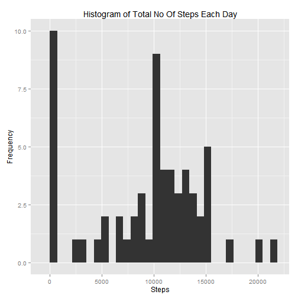
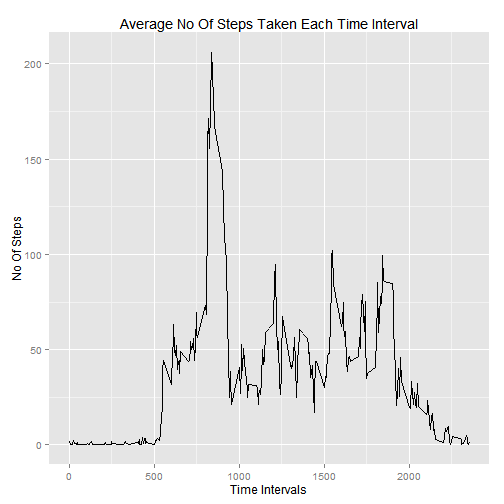
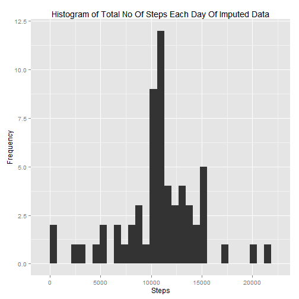
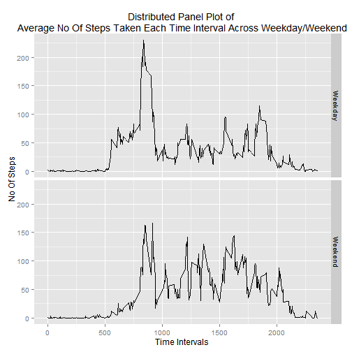

### Loading Required Packages

```r
require("dplyr")
require("ggplot2")
```

### Loading and preprocessing the data

```r
data<-read.csv("activity.csv")
```


### Mean total number of steps taken per day?

#### Calculate Total No Of Steps Per Day
##### Table Denoting No Total No of Steps Taken Each Day

```r
# Grouping the data by "Date"
grouped_by_date<-group_by(data[,1:2],date)

# Summarising the data
summarised_by_sum_date<-summarise_each(grouped_by_date,funs(sum(steps,na.rm = TRUE)))
```

#### Histogram Of Total No Of Steps Taken Per Day

```r
# Using Ggplot to create the histogram
ggplot(summarised_by_sum_date,aes(x=steps))+ylab("Frequency")+xlab("Steps")+geom_histogram()+ggtitle("Histogram of Total No Of Steps Each Day")
```

 

#### Mean

```r
mean(summarised_by_sum_date$steps)
```

```
## [1] 9354.23
```

#### Median

```r
median(summarised_by_sum_date$steps)
```

```
## [1] 10395
```

### What is the average daily activity pattern?


```r
# Grouping the cleaned data by intervals
grouped_by_interval<-group_by(data[,c(1,3)],interval)

# Summarising the data
summarised_by_mean_interval<-summarise_each(grouped_by_interval,funs(mean(steps,na.rm=TRUE)))

# Using Ggplot to create the histogram
ggplot(summarised_by_mean_interval,aes(x=interval,y = steps))+geom_line()+ggtitle("Average No Of Steps Taken Each Time Interval")+xlab("Time Intervals")+ylab("No Of Steps")
```

 

### Time Interval With Maximum Steps
Maximum No Of Steps Taken In a Time Interval Is

```r
max_steps=max(summarised_by_mean_interval$steps)
max_steps_simple=as.integer(max_steps)
```
i.e. 206 steps

And that particular time interval is

```r
data.frame(summarised_by_mean_interval)[summarised_by_mean_interval$steps==max_steps,1]
```

```
## [1] 835
```
i.e. from 8:35 AM to 8:40 AM avg maximum steps are observed

### Imputing missing values

#### Total number of missing values in the dataset (i.e. the total number of rows with NAs)

```r
na_steps=sum(is.na(data$steps))
```
Total No of Missing Records=2304

#### Strategy For Imputing Missing Values
For imputing the missing values we will be replacing the NAs with the mean taken across all days for that particular 5-minute interval


```r
mean_of_intervals<-as.data.frame(summarised_by_mean_interval)

#Iterating over all the rows in data frame and replacing those values with mean value that are NA.
for(i in 1:nrow(data))
{
        if(is.na(data[i,]["steps"]))
        {
        data[i,]["steps"]<-mean_of_intervals[mean_of_intervals==as.integer(data[i,]["interval"]),2][1]
        }
}
```
#### Dataset with missing values imputed

```r
head(data)
```

```
##       steps       date interval
## 1 1.7169811 2012-10-01        0
## 2 0.3396226 2012-10-01        5
## 3 0.1320755 2012-10-01       10
## 4 0.1509434 2012-10-01       15
## 5 0.0754717 2012-10-01       20
## 6 2.0943396 2012-10-01       25
```

#### Histogram Of Total No Of Steps Taken Per Day

```r
# Grouping the cleaned data by "Date"
grouped_by_date<-group_by(data[,1:2],date)

# Summarising the data
summarised_by_sum_date<-summarise_each(grouped_by_date,funs(sum))

# Using Ggplot to create the histogram
ggplot(summarised_by_sum_date,aes(x=steps))+ylab("Frequency")+xlab("Steps")+geom_histogram()+ggtitle("Histogram of Total No Of Steps Each Day Of Imputed Data")
```

 

#### Mean

```r
mean(summarised_by_sum_date$steps)
```

```
## [1] 10766.19
```

#### Median

```r
median(summarised_by_sum_date$steps)
```

```
## [1] 10766.19
```
Both mean and median has increased after imputing the values becuase of the contribution by the observations those had NA steps.

### Are there differences in activity patterns between weekdays and weekends?
#### Adding a factor variable on the basis of day

```r
# Adding a factor variable on the basis of day
findDay<-function(date){
      weekday<-weekdays(as.Date(date));
      if(weekday %in% c("Saturday","Sunday"))
      {
              return("Weekend")
      }
      else
      {
              return("Weekday")
      }
}
data$day=sapply(data$date,findDay)
sample_n(data,5)
```

```
##          steps       date interval     day
## 3315   0.00000 2012-10-12     1210 Weekday
## 1414   0.00000 2012-10-05     2145 Weekday
## 3317   0.00000 2012-10-12     1220 Weekday
## 17503 77.69811 2012-11-30     1830 Weekday
## 4490   0.00000 2012-10-16     1405 Weekday
```
#### Creating a distributed panel plot on the basis of factor variable 'Weekday'

```r
# Aggregating the data on steps for each interval and day
summarised_by_interval_day<-aggregate(steps~interval+day,data=data,mean)

# Using Ggplot to create the histogram
ggplot(summarised_by_interval_day,aes(x=interval,y = steps))+geom_line()+facet_grid(day ~ .)+ggtitle("Distributed Panel Plot of \nAverage No Of Steps Taken Each Time Interval Across Weekday/Weekend")+xlab("Time Intervals")+ylab("No Of Steps")
```

 
